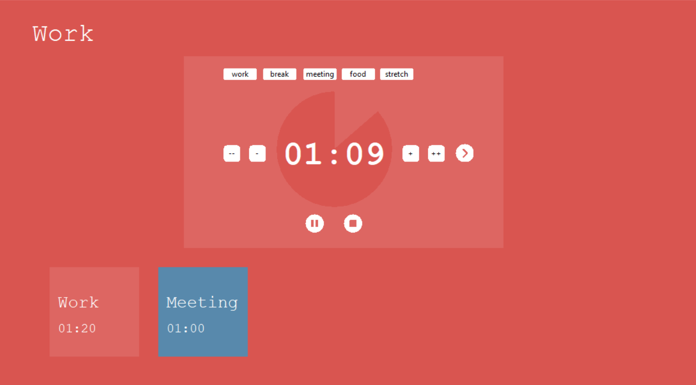

# Pymodoro | Custom Pomodoro Method

Pymodoro is a Python GUI for customizing the pomodoro method to your needs.



<ins>Why Pymodoro?</ins>

Why use this over something like [pomofocus.io](https://pomofocus.io/), you ask? And why does Pymodoro look exactly like pomofocus, you wonder? Well... you can't prove the second one, and who's to say who copied who?

For why Pymodoro, I found myself liking the *concept* of the pomodoro method, but my needs change day to day. Some days I'm able to hyperfocus more and want to work longer stretches of time, while others I may need a lot more breaks to do quality work. Some days I have a ton of meetings that I need to complete my work around, and on those days, the pomodoro method really makes no sense. 

<ins>Is this even pomodoro then?</ins>

I don't know. You could technically use this to do Pomodoro, but I think my personal use case will probably not mirror pomodoro too closely. The pun opportunity was too great to pass up, though.

## Dependencies

If it wasn't obvious from the name, you need Python. I'm running Python 3.7.1. I don't know if it runs on Python 2.7, maybe you can be my guinea pig and check :)

Pymodoro uses tkinter for most of its GUI and pygame to play sound bytes cross-platform
```bash
pip install tk
pip install pygame
```

## Installation

Clone this repo to use Pymodoro

```bash
git clone https://github.com/awaseem2/Pymodoro.git
```

## Usage

```bash
cd Pymodoro
py main.py
```

## Future features
- [ ] Support adding custom labels dynamically
- [ ] Support deleting tasks from queue
- [ ] Display total time / time when you will finish ?
- [ ] Support rearranging queue ???

Have fun and I hope you will now be vv productive
